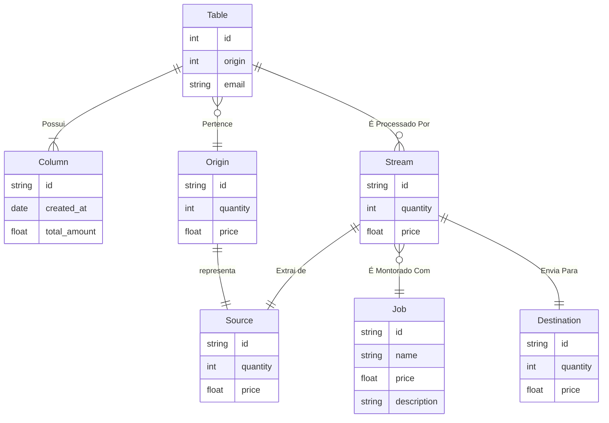

# Python Data Integration

## Diagrama ER

## Description
This Entity Relationship Diagram shows:
- A Customer can place multiple Orders
- Each Order can contain multiple Order Items
- Each Order Item is associated with a Product
- The attributes of each entity are listed within the entity boxes